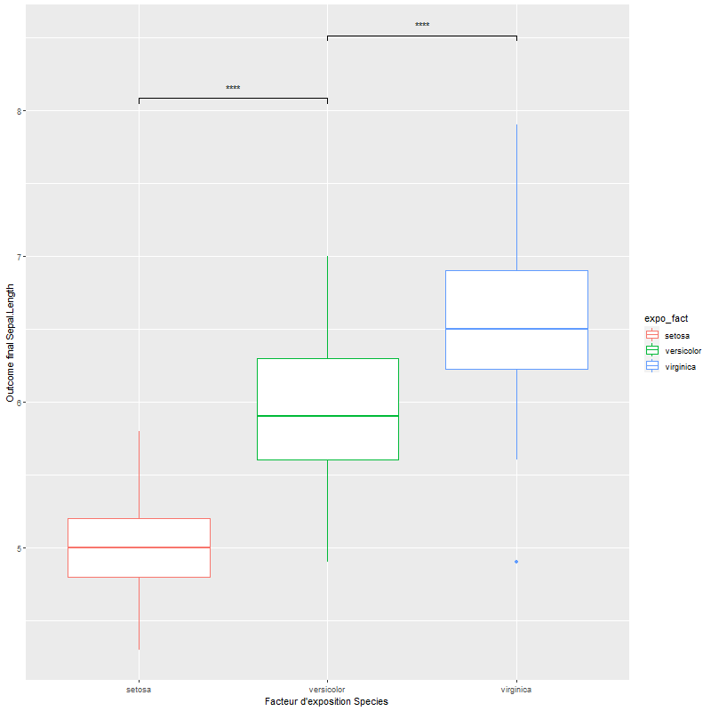

# Source_R
Ce Repo regroupe les fonctions que j'ai dévollopé durant mon stage, ainsi que quand cela m'a été demandé un exemple minimum reproductible de leur utilisations.

Ci dessous la liste des exemples :
[Box plot avec teste de significativité pour les modalité adjacente d'un facteur](exemples/box_plot_signif_group_adjacent/box_plot_test_signifgroup_contigu.R)  

